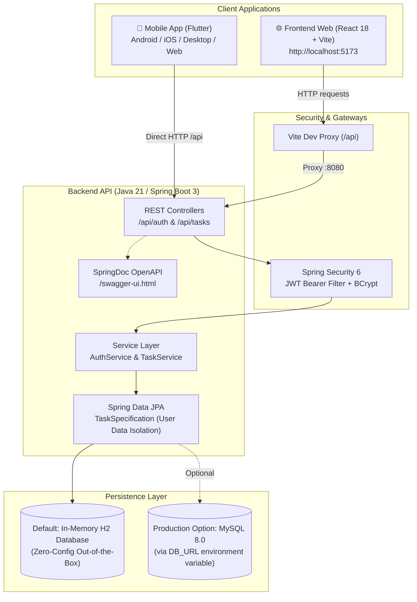

# 📋 Task Manager — Full-Stack Monorepo

[](https://openjdk.org/projects/jdk/21/)
[](https://spring.io/projects/spring-boot)
[](https://react.dev/)
[](https://vitejs.dev/)
[](https://tailwindcss.com/)
[](https://flutter.dev/)
[](https://jwt.io/)

A modern, production-ready, multi-client Task Management ecosystem featuring:
- **Backend**: Spring Boot 3.3 REST API (Java 21) with Spring Security 6, JWT stateless authentication, Spring Data JPA Specifications, and OpenAPI / Swagger UI.
- **Frontend Web**: React 18 Single Page Application built with Vite, TypeScript, Tailwind CSS (modern dark glassmorphism theme), and TanStack Query v5.
- **Mobile App**: Cross-platform Flutter application (Android, iOS, Desktop, Web) featuring Provider state management, Dio networking, and Flutter Secure Storage.

---

## 📑 Table of Contents

1. [Architecture Overview](#-architecture-overview)
2. [Project Structure](#-project-structure)
3. [Prerequisites](#-prerequisites)
4. [Quick Start (TL;DR)](#-quick-start-tldr)
5. [Step-by-Step Running Guide](#-step-by-step-running-guide)
   - [1. Backend REST API](#1-backend-rest-api-spring-boot-3)
   - [2. Frontend Web Application](#2-frontend-web-application-react-18--vite)
   - [3. Mobile Application](#3-mobile-application-flutter)
6. [API Documentation & Swagger](#-api-documentation--swagger)
7. [Testing the Application](#-testing-the-application)
8. [Environment Variables Reference](#-environment-variables-reference)
9. [Troubleshooting & FAQ](#-troubleshooting--faq)
10. [Architectural Decisions Reference](#-architectural-decisions-reference)

---

## 🏗️ Architecture Overview



---

## 📁 Project Structure

```text
cova-test/
├── backend/                       # Spring Boot 3.3 + Java 21 REST API
│   ├── pom.xml                    # Maven build file (Spring Boot, Security, JJWT, H2, MySQL, SpringDoc)
│   └── src/
│       ├── main/
│       │   ├── java/com/taskmanager/
│       │   │   ├── config/        # SecurityConfig, OpenApiConfig
│       │   │   ├── controller/    # AuthController, TaskController
│       │   │   ├── dto/           # Java 21 Records (Requests, Responses, PageResponse)
│       │   │   ├── entity/        # UserEntity, TaskEntity, TaskStatus (JPA)
│       │   │   ├── exception/     # GlobalExceptionHandler (@RestControllerAdvice)
│       │   │   ├── mapper/        # DTO <-> Entity mappers
│       │   │   ├── repository/    # Spring Data JPA repositories & TaskSpecification
│       │   │   ├── security/      # JwtTokenProvider, JwtAuthenticationFilter, UserPrincipal
│       │   │   └── service/       # AuthService, TaskService & implementations
│       │   └── resources/
│       │       └── application.yml# Spring Boot configuration (H2 by default, ports, JWT)
│       └── test/                  # JUnit 5 & Mockito test suite (27 passing tests)
│
├── frontend-web/                  # React 18 + Vite + TypeScript Web Client
│   ├── package.json               # Scripts & dependencies (TanStack Query, Axios, Lucide)
│   ├── vite.config.ts             # Vite config with /api reverse proxy to http://localhost:8080
│   ├── tailwind.config.js         # Tailwind CSS styling configuration
│   └── src/
│       ├── api/                   # Axios client with JWT interceptors & endpoint services
│       ├── components/            # UI components (TaskCard, TaskFormModal, Navbar, etc.)
│       ├── context/               # AuthContext (state, token storage, logout handler)
│       ├── hooks/                 # React Query hooks (useTasks query & mutations)
│       ├── pages/                 # LoginPage, RegisterPage, DashboardPage
│       └── routes/                # ProtectedRoute & AppRoutes
│
├── mobile-flutter/                # Cross-Platform Flutter Mobile Application
│   ├── pubspec.yaml               # Flutter dependencies (Dio, Provider, Secure Storage)
│   ├── lib/
│   │   ├── core/
│   │   │   ├── constants/         # ApiConstants (smart baseUrl detection for Android/iOS)
│   │   │   ├── network/           # Dio ApiClient & AuthInterceptor
│   │   │   └── theme/             # Modern dark theme definitions
│   │   ├── models/                # User, Task, and AuthResponse models
│   │   ├── providers/             # AuthProvider & TaskProvider
│   │   ├── repositories/          # AuthRepository & TaskRepository
│   │   ├── screens/               # LoginScreen, RegisterScreen, TaskListScreen, TaskFormScreen
│   │   └── main.dart              # Flutter application entry point
│   └── test/                      # Unit & serialization tests
│
└── TECHNICAL_DECISIONS.md         # Comprehensive architectural justifications (French)
```

---

## ⚙️ Prerequisites

Make sure the following runtimes and tools are installed on your workstation:

| Component | Required Version | Verification Command |
| :--- | :--- | :--- |
| **Java JDK** | **Java 21 LTS** | `java -version` |
| **Apache Maven** | **3.8.x or 3.9.x** | `mvn -version` |
| **Node.js & npm** | **Node 18+ (20+ recommended)** | `node -v && npm -v` |
| **Flutter SDK** | **Flutter 3.x (Dart 3+)** | `flutter --version` |

> [!TIP]
> **No MySQL installation is mandatory!** The backend runs out of the box with an embedded in-memory **H2 database**. You can run all 3 applications immediately without setting up an external database.

---

## ⚡ Quick Start (TL;DR)

For experienced developers who want all services running in 3 terminal tabs:

```bash
# Tab 1 — Backend (starts on port 8080 with in-memory H2)
cd backend && mvn spring-boot:run

# Tab 2 — Frontend Web (starts on http://localhost:5173)
cd frontend-web && npm install && npm run dev

# Tab 3 — Mobile Flutter (targets connected emulator, chrome, or desktop)
cd mobile-flutter && flutter pub get && flutter run
```

---

## 🚀 Step-by-Step Running Guide

### 1. Backend REST API (Spring Boot 3)

The backend provides the centralized REST API, business logic, user isolation, and security layer.

#### Step 1.1 — Navigate to the backend directory
```bash
cd backend
```

#### Step 1.2 — Configure Environment Variables (`.env`)
The project uses `.env` files for configuration. A template `.env.example` is provided:
#### Step 1.2 — Run with the default In-Memory H2 Database
The application is preconfigured to use an in-memory H2 database by default (`taskmanager_db`). Simply start the Spring Boot application:

```bash
# In backend/ (or project root):
cp .env.example .env
mvn spring-boot:run
```

Your `backend/.env` already contains your configured credentials:
```env
DB_URL=jdbc:mysql://localhost:3306/tasks?createDatabaseIfNotExist=true&useSSL=false&allowPublicKeyRetrieval=true&serverTimezone=UTC
DB_USERNAME=marcsitze
DB_PASSWORD=12345678
DB_DRIVER=com.mysql.cj.jdbc.Driver
SERVER_PORT=8080
```
The server will start on **`http://localhost:8080`**.

#### Step 1.3 — Start the Backend
Load `.env` and start the Spring Boot server:
#### Step 1.3 — Run with MySQL Database
Your local environment variables (`DB_URL`, `DB_USERNAME`, `DB_PASSWORD`, `DB_DRIVER`) are already configured in `~/.bashrc` and `.env`:
Your MySQL credentials are configured project-locally in `backend/.env` and via the `mysql` Spring profile (`application-mysql.yml`):

```bash
cd backend
export $(cat .env | grep -v '^#' | xargs) && mvn spring-boot:run
# MySQL Credentials configured:
DB_URL="jdbc:mysql://localhost:3306/tasks?createDatabaseIfNotExist=true&useSSL=false&allowPublicKeyRetrieval=true&serverTimezone=UTC"
DB_USERNAME="marcsitze"
DB_PASSWORD="12345678"
DB_DRIVER="com.mysql.cj.jdbc.Driver"
```
- **Option A (Recommended — Spring Profile)**:
  ```bash
  cd backend
  mvn spring-boot:run -Dspring-boot.run.profiles=mysql
  ```

*(Note: If you run `mvn spring-boot:run` without exporting `.env`, it will automatically fall back to the built-in zero-config in-memory H2 database).*
To run with these credentials:
```bash
# In any new terminal (or after running: source ~/.bashrc)
mvn spring-boot:run
```
- **Option B (Loading project `.env`)**:
  ```bash
  cd backend
  export $(cat .env | grep -v '^#' | xargs) && mvn spring-boot:run
  ```

Hibernate will automatically connect to the `tasks` database on MySQL and ensure schema tables (`users`, `tasks`) are updated.

#### Step 1.4 — Verify Backend Health & Swagger UI
Once running, verify that the backend is responding:
- **Swagger UI (Interactive API Explorer)**: [http://localhost:8080/swagger-ui.html](http://localhost:8080/swagger-ui.html)
- **OpenAPI JSON Docs**: [http://localhost:8080/v3/api-docs](http://localhost:8080/v3/api-docs)

---

### 2. Frontend Web Application (React 18 + Vite)

The web dashboard provides a sleek, responsive interface to register, log in, create tasks, edit them, toggle statuses, search, and paginate.

#### Step 2.1 — Navigate to the frontend directory
```bash
cd frontend-web
```

#### Step 2.2 — Install dependencies
```bash
npm install
```

#### Step 2.3 — Launch the development server
```bash
npm run dev
```

The frontend will be available at **`http://localhost:5173`**.

#### Step 2.4 — Accessing the Web App
Open your browser and navigate to:
👉 **`http://localhost:5173`**

> [!NOTE]
> **Zero-CORS Configuration**: The Vite dev server is preconfigured with a reverse proxy in `vite.config.ts`. All `/api/*` requests sent by Axios in the frontend are automatically proxied to `http://localhost:8080/api/*`, eliminating any CORS or header issues during local development.

---

### 3. Mobile Application (Flutter)

The Flutter application provides a full-featured native mobile client supporting Android, iOS, Desktop (Linux/macOS/Windows), and Web.

#### Step 3.1 — Navigate to the mobile directory
```bash
cd mobile-flutter
```

#### Step 3.2 — Retrieve dependencies
```bash
flutter pub get
```

#### Step 3.3 — Check available target devices
List all connected physical devices, emulators, and desktop environments:
```bash
flutter devices
```
*Example output:*
```text
  sdk gphone16k x86 64 (mobile) • emulator-5554 • android-x64    • Android 17 (API 37) (emulator)
  Linux (desktop)               • linux         • linux-x64      • Ubuntu 24.04
  Chrome (web)                  • chrome        • web-javascript • Google Chrome
```

#### Step 3.4 — Launch the application

- **On Android Emulator**:
  ```bash
  flutter run -d emulator-5554
  ```

- **On Desktop (Linux / macOS / Windows)**:
  ```bash
  flutter run -d linux      # or macos / windows depending on your OS
  ```

- **In Google Chrome (Web target)**:
  ```bash
  flutter run -d chrome
  ```

- **Default device (auto-selected)**:
  ```bash
  flutter run
  ```

#### Step 3.5 — Network Configuration for Mobile

The Flutter app includes intelligent base URL resolution in [`lib/core/constants/api_constants.dart`](file:///home/marcsitze/Documents/cova-test/mobile-flutter/lib/core/constants/api_constants.dart):

| Target Platform | Resolved Backend URL | Notes |
| :--- | :--- | :--- |
| **Android Emulator** | `http://10.0.2.2:8080/api` | Handled automatically by `Platform.isAndroid` (maps to host's `localhost`). |
| **iOS Simulator / Desktop / Web** | `http://localhost:8080/api` | Handled automatically. |
| **Physical Phone (USB / Wi-Fi)** | `http://<YOUR_LOCAL_IP>:8080/api` | Replace with your machine's LAN IP (e.g. `192.168.1.50`). Ensure your phone is connected to the same Wi-Fi. |

---

## 📖 API Documentation & Swagger

When the backend is running, open the **OpenAPI 3 / Swagger UI** documentation at:
🔗 **[http://localhost:8080/swagger-ui.html](http://localhost:8080/swagger-ui.html)**

You can test all endpoints interactively directly from the browser:

### Authentication Endpoints
| HTTP Method | Endpoint | Description | Public / Protected |
| :--- | :--- | :--- | :--- |
| `POST` | `/api/auth/register` | Register a new user (`email`, `password`) | Public |
| `POST` | `/api/auth/login` | Authenticate user & return JWT token | Public |

### Task Management Endpoints
All task endpoints require the header: `Authorization: Bearer <your_jwt_token>`

| HTTP Method | Endpoint | Description | Query Parameters |
| :--- | :--- | :--- | :--- |
| `GET` | `/api/tasks` | Get paginated tasks for logged-in user | `page`, `size`, `status`, `search`, `sort` |
| `POST` | `/api/tasks` | Create a new task | — |
| `GET` | `/api/tasks/{id}` | Get task details by ID | — |
| `PUT` | `/api/tasks/{id}` | Update task title, description, and status | — |
| `PATCH` | `/api/tasks/{id}/status` | Fast update of task status (`TODO`, `IN_PROGRESS`, `DONE`)| — |
| `DELETE` | `/api/tasks/{id}` | Permanently delete a task | — |

---

## 🧪 Testing the Application

### 1. Manual End-to-End Verification (via cURL)

You can quickly register a user and create your first task from your terminal:

```bash
# 1. Register a new user
curl -X POST http://localhost:8080/api/auth/register \
  -H "Content-Type: application/json" \
  -d '{"email": "architect@taskmanager.com", "password": "SecretPassword123!"}'

# 2. Login to get a JWT token
TOKEN=$(curl -s -X POST http://localhost:8080/api/auth/login \
  -H "Content-Type: application/json" \
  -d '{"email": "architect@taskmanager.com", "password": "SecretPassword123!"}' \
  | grep -o '"token":"[^"]*' | cut -d'"' -f4)

echo "JWT Token: $TOKEN"

# 3. Create a task
curl -X POST http://localhost:8080/api/tasks \
  -H "Authorization: Bearer $TOKEN" \
  -H "Content-Type: application/json" \
  -d '{"title": "Deploy to Cloud Run", "description": "Configure multi-stage Docker build", "status": "IN_PROGRESS"}'

# 4. Fetch your tasks (paginated)
curl -X GET "http://localhost:8080/api/tasks?page=0&size=10" \
  -H "Authorization: Bearer $TOKEN"
```

### 2. Automated Test Suites

All components are equipped with comprehensive automated tests:

```bash
# 1. Backend tests (JUnit 5 + Mockito + MockMvc - 27 tests)
cd backend && mvn test

# 2. Frontend tests (Vitest + React Testing Library - 6 tests)
cd frontend-web && npm test

# 3. Mobile tests (Flutter Test)
cd mobile-flutter && flutter test
```

---

## 🔧 Environment Variables Reference

### Backend (`backend/src/main/resources/application.yml`)

| Variable | Default Value | Description |
| :--- | :--- | :--- |
| `SERVER_PORT` | `8080` | HTTP port on which Spring Boot listens. |
| `DB_URL` | `jdbc:h2:mem:taskmanager_db;...` | JDBC database connection string (H2 or MySQL). |
| `DB_USERNAME` | `sa` | Database username. |
| `DB_PASSWORD` | *(empty)* | Database password. |
| `DB_DRIVER` | `org.h2.Driver` | JDBC Driver class (`com.mysql.cj.jdbc.Driver` for MySQL). |
| `JPA_DDL_AUTO` | `update` | Hibernate schema mode (`update`, `validate`, `create-drop`). |
| `JWT_SECRET` | *(64-character default)* | HMAC-SHA256 secret key for signing tokens. |
| `JWT_EXPIRATION` | `86400000` (24 hours) | Token validity duration in milliseconds. |
| `CORS_ALLOWED_ORIGINS` | `http://localhost:5173,http://localhost:3000` | Allowed origins for cross-origin requests. |

### Frontend (`frontend-web`)

| Variable | Default Value | Description |
| :--- | :--- | :--- |
| `VITE_API_URL` | `/api` | Base API URL prefix (proxied to backend by Vite). |

---

## ❓ Troubleshooting & FAQ

### Port 8080 or 5173 is already in use
If another process is using port 8080 or 5173:
```bash
# Find what process is running on 8080
lsof -i :8080
# Or using ss:
ss -tulpn | grep 8080

# To start the backend on a different port (e.g., 8081):
SERVER_PORT=8081 mvn spring-boot:run
```
*(Note: If changing backend port to 8081, remember to adjust `target: 'http://localhost:8081'` in `frontend-web/vite.config.ts`).*

### Mobile app cannot connect to backend
- **Android Emulator**: Ensure calls point to `http://10.0.2.2:8080/api` (not `localhost`). This is automatically handled by `ApiConstants.baseUrl`.
- **Physical Device**: Connect your smartphone and computer to the same Wi-Fi network and edit `mobile-flutter/lib/core/constants/api_constants.dart` to point to your computer's local IP (e.g. `http://192.168.1.25:8080/api`). Ensure your OS firewall allows incoming traffic on port 8080.

### Token expiration / 401 Unauthorized
Tokens are valid for 24 hours. If a request returns `401 Unauthorized`:
- The **Frontend Web** automatically clears `localStorage` and redirects to `/login?expired=true`.
- The **Mobile App** triggers the `onUnauthorized` callback in `ApiClient` to prompt a re-login.

---

## 📚 Architectural Decisions Reference

For a thorough, senior-architectural breakdown of why specific technologies and patterns were chosen (BCrypt cost factor, JWT vs HTTP-only cookies, TanStack Query vs Redux, JPA Specifications vs JPQL, user data isolation mechanisms, etc.), refer to:
👉 [**TECHNICAL_DECISIONS.md**](file:///home/marcsitze/Documents/cova-test/TECHNICAL_DECISIONS.md)

